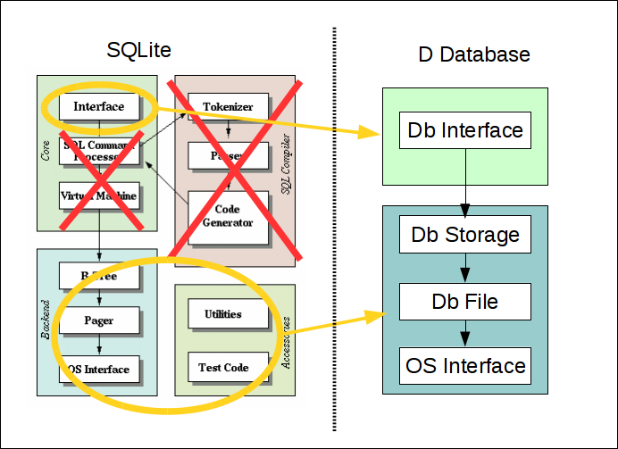

## About

This is a project of a database engine embedded into the D language. It does't use any other technologies like SQL. It can be seen as a variant of object database. Queries are constructed by D syntax (e.g. using  std.algorithm) mainly via range interface. 

## Status: Proof of concept

For the time being, don't use for other purposes than fun and development

## Architecture

The D database engine design is inspired by SQLite database backend. 
Only some high level concepts are similar. In general, all details differ greatly.
Because there is no translation to SQL or any other intermediate layer, a query execution is managed directly by user code. 



## Key features (unfinished)

* ACID
* SQL is not use at any stage
* fast
* full compatibility with D algorithms and ranges
* nothrow @safe @nogc
* minimal storage size in one file

## Disadvantages
* Challenging usage of indexes
* The RPC nature of SQL queries are not possible without additional functionality and currently there are no plans to allow it.

## Example
```d
ushort pageSize = 256;

static struct A
{
	int a;
	int b;
}
ubyte[] storageFileBytes;
storageFileBytes.length = 2 * pageSize;

DbFile dbFile = DbFile(storageFileBytes, pageSize);
DbStorage dbStorage = DbStorage(dbFile, pageSize);
DataBase db = DataBase(&dbStorage);
db.createStorage();

auto numDbColl = db.createCollection!A("B.numbers");

int[] numbers = [40,41,42,43];
int c =1;
numbers
	.map!(a => A(a,c++))
		.copy(numDbColl);

auto data = db.collection!A("B.numbers");

writeln(data);

assert(data.array == [A(40,1),A(41,2), A(42,3), A(43,4)]);
```


##Initial decisions and their justification. 
Everything is subject to change.


###API
* Database
    * db management (create, open, close, delete, etc,)
* Collection
    * range API (empty, pop, front, etc.)
    * custom API 
* Item
    * itemId

###File format 
* one file
* divided into pages
* little endian data format
* variable length object storage (cells)

###Page Format
* page contains header and payload
* payload area contains fixed number of same size slots
* slot can be either data or a pointer 
    * if type size is greater than pointer size - pointer is used
    * else raw data is put into the slot

###Pointer Format
* flag
* offset
* pageId

Or (depending on flags)

* flag
* data

###Cell Format
* variable-length integer

###Cell Lookup
* by offset computed from itemId
* if available guided by indexes (challenging)

####Types
* Allowed types
    * classes
    * structs
    * enumns
    * scalar type
    * array
* direct or via proxy object retrieval patterns
* accessing members by value or reference
    * member object embedded in the same table or separate
* implicit conversion to string or string[string]
    * usable for unknown types
* name checking of object members
    * fields
    * types
    * number of members