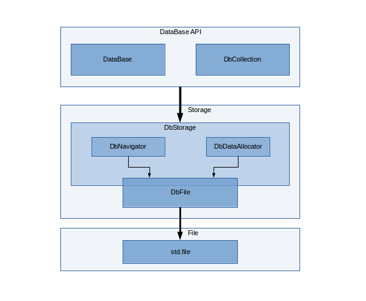
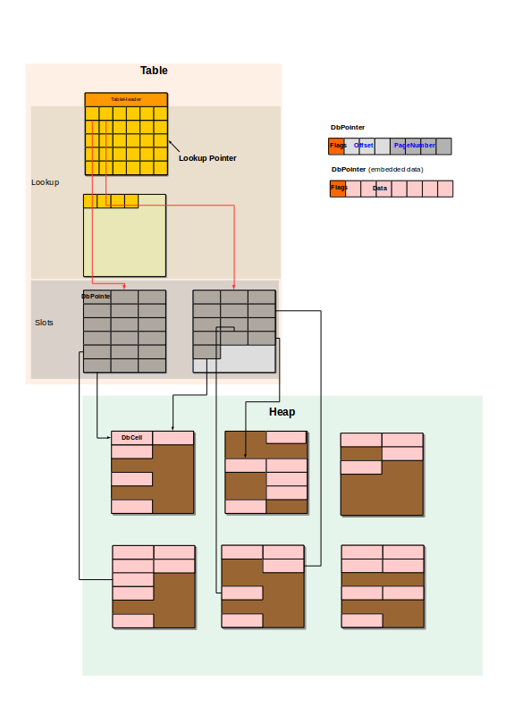

## About

This is a project of a database engine embedded into the D language. It doesn't use any external libraries and SW. It also doesn't act as an interface/driver to other database engines. 

It can be seen as persistence storage for array of objects. However there are  additional concepts incorporated from database domain. Queries are constructed by D syntax (e.g. using std.algorithm) mainly via range interface. 

## Status: Proof of concept

For the time being, don't use for other purposes than fun and development

## Architecture

The D database engine design is inspired by SQLite database backend. 
Only some concepts are similar. In general implementation of the storage engine is not compatible with SQLite in any way.
Because there is no translation to SQL or any other intermediate language, a query execution is managed directly by user code (with the exception of index (lookup) handling which is performed by the storage engine). 



The Storage API is meant to be simple for seamless replacement. 

## File format

Database storage is based on paging. Its current status is in early stage.



## Key features

* ACID (not implemented yet)
* Lack of domain specific language (e.g. SQL)
* Fast (not implemented yet)
* Full compatibility with D algorithms and ranges
* Suitable for embedded systems (not implemented yet)
* Minimal overhead: nothrow @nogc (not implemented yet)
* Minimal storage size in one file (not implemented yet)

## Disadvantages
* Index usage requires strings and CTFE (e.g. filter!q{item.id <10 && item.group == "AB"})
* The RPC nature of SQL queries are not possible without additional functionality and currently there are no plans to allow it.

## Example
```d
	static struct A
	{
		int a;
		short b;
	}

	static struct B
	{
		uint a;
		long b;
		float c;
	}

	static struct C
	{
		int a;
		string name;
	}


	static struct D
	{
		string city;
		string country;
	}

	DataBase db = DataBase(null,128);
	auto collA = db.createCollection!A("SmallIntegers");
	auto collB = db.createCollection!B("Numbers");
	auto collC = db.createCollection!C("Mixed");
	auto collD = db.createCollection!D("Strings");

	int[] smallIntegers = [40,41,42,43];
	short c =1;
	smallIntegers
		.map!(a => A(a,c++))
			.copy(collA);

	auto numbers = [B(1,-1,0.2), B(100_000_000,-1_000_000_000_000,8.71234), B(9_876,5_123_456_789_012,-0.2)];
	numbers.copy(collB);

	auto mixed = [C(1,"test"), C(2,"Hello World!"), C(-1,"Boom"), C(0,"P")];
	mixed.copy(collC);

	auto strings = [D("Poznan","Poland"), D("Budapest","Hungary"), D("Warsaw","Poland"), D("Phobos","Mars")];
	strings.copy(collD);

	auto data = db.collection!A("SmallIntegers");
	assert(data.array == [A(40,1),A(41,2), A(42,3), A(43,4)]);

	auto data2 = db.collection!B("Numbers");
	assert(data2.array == numbers);

	auto data3 = db.collection!C("Mixed");
	assert(data3.array == mixed);

	auto data4 = db.collection!D("Strings").filter!(s => (s.country == "Poland" || s.city.canFind("dap")));

	assert(data4.array == [D("Poznan","Poland"), D("Budapest","Hungary"), D("Warsaw","Poland")]);

```


##Initial decisions and their justification. 
Everything is subject to change.


###API
* Database
    * db management (create, open, close, delete, etc,)
* Collection
    * range API (empty, pop, front, etc.)
    * custom API 
* Item
    * itemId

###File format 
* one file
* divided into pages
* little endian data format
* variable length object storage (cells)

###Page Format
* page contains header and payload
* payload area contains fixed number of same size slots
* slot can be either data or a pointer 
    * if type size is greater than pointer size - pointer is used
    * else raw data is put into the slot

###Pointer Format
* flag
* offset
* pageId

Or (depending on flags)

* flag
* data

###Cell Format
* variable-length integer

###Cell Lookup
* by offset computed from itemId
* if available guided by indexes (challenging)

####Types
* Allowed types
    * classes
    * structs
    * enumns
    * scalar types
    * arrays
* direct or via proxy object retrieval patterns
* accessing members by value or reference
    * member object embedded in the same table or separate
* implicit conversion to string or string[string]
    * usable for unknown types
* name checking of object members
    * fields
    * types
    * number of members